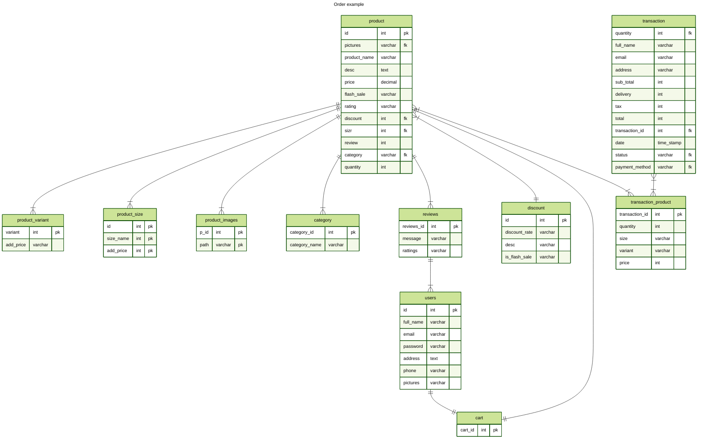

# ERD coffee shop

<!--
buatkan query dalam file query.sql mendapatkan satu product yang sudah di agregasikan dengan variant dan size yang dipilih

final expectation: product, size, variant
-->

```mermaid

---
title: Order example
---
erDiagram

    %%{init: {'theme': 'forest'}}%%

    product {
        id int pk
        pictures varchar fk
        product_name varchar
        desc text
        price decimal
        flash_sale varchar
        rating varchar
        discount int fk
        sizr int fk
        review int
        category varchar fk
        quantity int
    }
    
    product_variant {
        variant int pk
        add_price varchar
    }
    
    product_size {
        id int pk
        size_name int pk
        add_price int pk
    }
    
    product_images {
        p_id int pk
        path varchar pk
    }

    discount {
        id int pk
        discount_rate varchar
        desc varchar
        is_flash_sale varchar
    }
    
    category {
        category_id int pk
        category_name varchar
    }

    reviews {
        reviews_id int pk
        message varchar
        rattings varchar
    }

    product ||--|{product_variant: ""
    product ||--|{product_size : ""
    product ||--|{product_images : ""
    product ||--|{category : ""
    product ||--|{reviews : ""
    product }|--||discount : ""

    reviews ||--|{users : ""
    product ||--||cart : ""
    users ||--||cart : ""

    cart {
        cart_id int pk
    }

    users {
        id int pk
        full_name varchar
        email varchar
        password varchar
        address text
        phone varchar
        pictures varchar
    }

    transaction {
        quantity int fk
        full_name varchar
        email varchar
        address varchar
        sub_total int
        delivery int
        tax int
        total int
        transaction_id int fk
        date time_stamp
        status varchar fk
        payment_method varchar fk
    }

    transaction }|--|{ transaction_product : ""
    product }|--|{ transaction_product : ""

    transaction_product {
        transaction_id int pk
        quantity int
        size varchar
        variant varchar
        price int
    }

```
