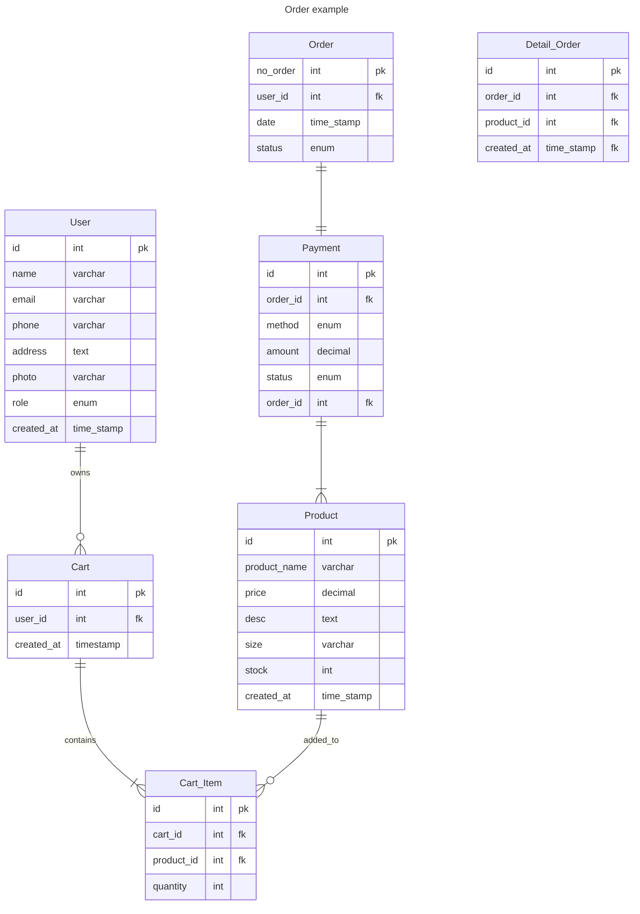

# ERD coffee shop

<!-- USER ||--o{ ORDER : places -->

<!-- 

    CUSTOMER ||--o{ ORDER : places
    ORDER ||--|{ LINE-ITEM : contains
    CUSTOMER }|..|{ DELIVERY-ADDRESS : uses

 -->

```mermaid

---
title: Order example
---
erDiagram

    
    User {
        id int pk
        name varchar
        email varchar
        phone varchar
        address text
        photo varchar
        role enum
        created_at time_stamp
    }

    Payment ||--|{ Product : ""
    Payment {
        id int pk
        order_id int fk
        method enum
        amount decimal
        status enum
        order_id int fk
    }

    Product {
        id int pk
        product_name varchar
        price decimal
        desc text
        size varchar
        stock int
        created_at time_stamp
    }

    User ||--o{ Cart : owns
    Cart ||--|{ Cart_Item : contains
    Product ||--o{ Cart_Item : added_to

    Cart {
        id int pk
        user_id int fk
        created_at timestamp
    }

    Cart_Item {
        id int pk
        cart_id int fk
        product_id int fk
        quantity int
    }

    Order {
        no_order int pk
        user_id int fk
        date time_stamp
        status enum
    }

    Order ||--|| Payment : ""
    Detail_Order {
        id int pk
        order_id int fk
        product_id int fk
        created_at time_stamp fk
    }

```
