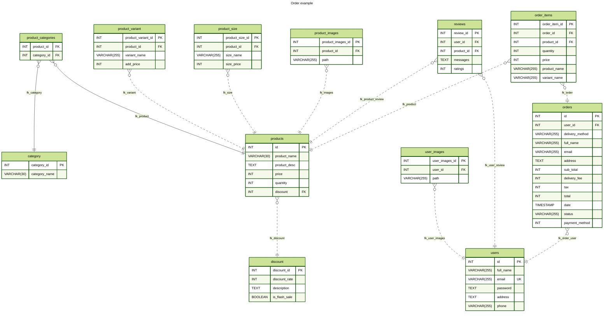

# ERD coffee shop

<!--
buatkan query dalam file query.sql mendapatkan satu product yang sudah di agregasikan dengan variant dan size yang dipilih

final expectation: product, size, variant

Buatkan query untuk mendapatkan sub total dari setiap barang yang dipilih dan tambhkan juga quantity
clue: menggunakan sub query

perbedaan
one to one
one to many

one to one penempatan foreign key ada di table
one to many penempatan foreign key ada di table utama

analisa di table landing page kubutuhan querynya apa saja
table card di landing page:
data product
* image
* title
* description
* rating
* price

table testimoni di landing pages:
* images
* message
* reviews

sintak join setelah on adalah kolom yang mempunyai hubungan dengan table lain

-->

